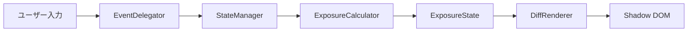

<h1 align="center">ndx</h1>
<p align="center"><strong>NDフィルター露出補正計算機</strong></p>
<p align="center">NDフィルター装着時の露出補正値を即座に算出する、依存関係ゼロのWeb Component</p>

<p align="center">
  <a href="./README.md">English</a> | <a href="./README.zh.md">中文</a>
</p>

<p align="center">
  
  
  
  
  
  
</p>

## ndx とは

NDフィルターを装着すると、光量が激減する。ND1000なら10段分の減光だ。シャッタースピードの標準値列は 2^(n/3) の等比数列に従い、強い減光では30秒を超えるバルブ領域に突入する。三脚を立てた撮影現場で「1/125がND1000で何秒になるか」を暗算するのは現実的ではない。

**ndx** はこの問題を `<ndx-calc>` タグひとつで解決する。ブログ記事のHTMLカードに貼り付けるだけで動作する。npm installは不要、ビルドステップも不要、CDN参照も不要。19 KBの単一HTMLブロックが、どんな環境でもそのまま動く。

## クイックスタート

```html
<ndx-calc></ndx-calc>
<script src="ndx.min.js"></script>
```

npm不要。ビルドツール不要。CDN不要。`dist/index.html` の内容をHTMLページやブログプラットフォームのHTMLカードにコピーするだけ。

### JavaScript無効環境のフォールバック

```html
<ndx-calc>
  <p style="padding:1em;text-align:center;color:#666;">
    ND Filter Calculator の動作にはJavaScriptが必要です。
  </p>
</ndx-calc>
```

## 機能

- **シャッタースピード / 絞り / ISO 補正** — シャッタースピードでの主補正に加え、絞り・ISOでの代替補正を表示
- **ND1〜ND20** — 1段から20段のフルレンジ＋クイックプリセット（ND4, ND8, ND16, ND64, ND1000）
- **バルブ領域外挿** — 30秒超は自動的に分・時間形式で表示（例: `8m 32s`, `2h 15m`）
- **EV表示** — NDフィルター適用前後の露出値を表示
- **ライト/ダーク自動切替** — `prefers-color-scheme` に自動追従
- **WCAG 2.1 AA準拠** — キーボードナビゲーション、ARIAロール、スクリーンリーダー対応、コントラスト比4.5:1以上
- **レスポンシブ** — モバイルファーストの単一カラム、576px以上で2カラムグリッド
- **完全オフライン** — ネットワーク通信なし、インターネット接続不要で動作
- **Shadow DOM隔離** — スタイルの漏洩なし、どこに埋め込んでも安全

## アーキテクチャ

クリーンアーキテクチャに基づく厳格な**単方向データフロー**:

```
ユーザー入力 → EventDelegator → StateManager → ExposureCalculator → ExposureState → DiffRenderer → Shadow DOM
```



### 1/3段インデックス方式

設計の核心: **全ての露出パラメータを1/3段単位の整数インデックスで内部管理する**。

浮動小数点誤差を完全に排除。段数計算は単純な整数加算に帰着する:

```
ND8（3段）= 3 × 3 = 9（1/3段オフセット）
1/125（インデックス18）+ 9 = インデックス27 → 1/15
```

- 表示値はルックアップテーブルから O(1) で取得
- バルブ領域（30秒超）は数式で外挿: `基準秒数 × 2^(オフセット/3)`
- 絞り・ISOは物理限界でクランプ、`isClamped` フラグでUI警告

→ [詳細アーキテクチャドキュメント](./docs/architecture.ja.md)

## カスタマイズ

CSS Custom Propertiesを上書きしてサイトのデザインに合わせられる。Shadow DOM境界を越えて適用可能:

```html
<style>
  ndx-calc {
    --ndx-accent: #e11d48;
    --ndx-accent-hover: #be123c;
    --ndx-radius-lg: 0;
    --ndx-font-family: 'Georgia', serif;
  }
</style>
```

| プロパティ | 用途 | デフォルト値（ライト） |
|----------|------|---------------------|
| `--ndx-accent` | アクセント色 | `#2563eb` |
| `--ndx-bg` | 背景色 | `#fafafa` |
| `--ndx-text` | テキスト色 | `#1a1a1a` |
| `--ndx-surface` | カード表面色 | `#ffffff` |
| `--ndx-border` | ボーダー色 | `#e0e0e0` |
| `--ndx-font-family` | フォント | `system-ui` |

→ [CSS API リファレンス（全22プロパティ）](./docs/api.md)

## ブラウザ対応

| ブラウザ | 最低バージョン |
|---------|-------------|
| Chrome | 67+ |
| Firefox | 63+ |
| Safari | 13.1+ |
| Edge | 79+ |

Custom Elements v1 と Shadow DOM v1 が必要。未対応ブラウザではフォールバックテキストを表示。

## 開発

### 前提条件

- [Bun](https://bun.sh/)（パッケージマネージャ兼ランタイム）

### コマンド

```bash
bun install                # 開発依存関係のインストール
bun run dev                # 開発サーバー（localhost:5173）
bun run build              # プロダクションビルド → dist/index.html
bun run test               # 全ユニットテスト実行（Vitest）
bun run test:watch         # ウォッチモード
bun run test:coverage      # カバレッジレポート
bun run test:e2e           # Playwright E2Eテスト
bun run lint               # Biome lint + フォーマットチェック
bun run lint:fix           # lint自動修正
bun run format             # 自動フォーマット
```

### 技術スタック

| ツール | 用途 |
|-------|------|
| Vite | 開発サーバー + ビルド（`vite-plugin-singlefile`） |
| Vitest | ユニット + インテグレーションテスト |
| Playwright | E2Eブラウザテスト |
| Biome | リンター + フォーマッター |
| happy-dom | UIユニットテスト用DOM環境 |

## プロジェクト構成

```
src/
├── domain/                  # ドメイン層（純粋JS、DOM依存なし）
│   ├── shutter-speed.js     # シャッタースピード値オブジェクト
│   ├── aperture.js          # 絞り値オブジェクト
│   ├── iso.js               # ISO値オブジェクト
│   ├── nd-filter.js         # NDフィルター値オブジェクト
│   ├── exposure-calculator.js  # ステートレス補正計算サービス
│   └── exposure-result.js   # 不変の計算結果
├── state/                   # 状態管理層
│   ├── exposure-state.js    # 不変状態（`with()` で部分更新）
│   └── state-manager.js     # オブザーバーパターン、再計算トリガー
├── ui/                      # UI層
│   ├── template.js          # Shadow DOM HTML生成
│   ├── styles.js            # CSS Custom Properties + スタイル
│   └── diff-renderer.js     # data-bind 差分DOM更新
├── ndx-calc-element.js      # Custom Elementエントリポイント
└── index.js                 # 登録
```

## 設計判断

**なぜ依存関係ゼロなのか？**
ndxはブログプラットフォームのHTMLカードに貼り付けて使う。外部依存（CDN、npmパッケージ）は障害点になり、非技術者ユーザーに摩擦を生む。

**なぜReact/Vue/Svelteを使わないのか？**
フレームワークのランタイムはバンドルサイズを何倍にも膨らませ、ゼロ依存制約に違反する。Web Componentsはカプセル化された再利用可能なUI要素のためのブラウザネイティブ解法。

**なぜ浮動小数点ではなく整数インデックスなのか？**
カメラの露出値は標準化された1/3段の等差数列に従うが、浮動小数点では正確にマッピングできない。整数インデックスならば段数計算は `index + offset` で完結し、丸め誤差が一切発生しない。

**なぜShadow DOMなのか？**
ブログプラットフォームのCSS環境は予測不能。Shadow DOMにより、ホストページのスタイルが計算機に影響せず、計算機のスタイルが外に漏れないことを保証する。CSS Custom Propertiesが制御されたテーマAPIを提供する。

## ライセンス

MIT License © 2026 [Yasunobu Sakashita](https://github.com/because-and)
