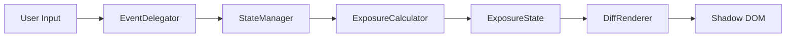

<h1 align="center">ndx</h1>
<p align="center"><strong>ND Filter Exposure Compensation Calculator</strong></p>
<p align="center">A zero-dependency Web Component that calculates adjusted exposure settings when an ND filter is applied.</p>

<p align="center">
  <a href="./README.ja.md">日本語</a> | <a href="./README.zh.md">中文</a>
</p>

<p align="center">
  
  
  
  
  
  
</p>

## What is ndx?

ND (Neutral Density) filters reduce the amount of light entering a lens, enabling creative techniques like long-exposure waterfalls, silky clouds, and motion blur in daylight. The problem is that compensating for an ND filter requires recalculating your exposure settings — and the math is anything but intuitive.

Shutter speed values follow a 2^(n/3) geometric progression across standardized 1/3-stop increments. With a heavy filter like an ND1000 (10 stops), a starting shutter speed of 1/125s becomes 8 seconds. Stack two filters and you're deep into bulb territory — minutes or even hours — where your camera's standard shutter speed dial simply stops. Mentally juggling shutter speed, aperture, and ISO offsets in the field, possibly in cold weather with gloves on, is slow and error-prone.

**ndx** solves this with a single HTML tag: `<ndx-calc>`. Paste it into any blog post or web page and your readers get an interactive exposure calculator — right there in the article. No npm install, no build step, no CDN dependency. Just one self-contained **19 KB** HTML block (5.7 KB gzipped) that works anywhere: Ghost, WordPress, Hugo, plain HTML, or any platform that accepts an HTML card.

## Quick Start

```bash
bun install
bun run build    # → dist/ndx.html
```

Open `dist/ndx.html` and copy its entire contents into your blog platform's HTML card (Ghost, WordPress, Hugo, etc.). That's it — the file contains the `<ndx-calc>` tag and a single `<script>` block with everything inlined.

No npm publish. No CDN link. No external files. Just paste and it works.

`dist/ndx.html` looks like this:

```html
<!-- ndx v1.0.0 | MIT License | https://github.com/P4suta/ndx -->
<ndx-calc>
  <p style="padding:1em;text-align:center;color:#666;">
    ND Filter Calculator requires JavaScript.
  </p>
</ndx-calc>
<script>/* ... minified component code ... */</script>
```

`dist/index.html` is also generated as a full standalone page for preview.

## Features

- **Shutter Speed / Aperture / ISO compensation** — Primary shutter speed adjustment with aperture and ISO alternatives
- **ND1–ND20 range** — Full 1 to 20 stop range with quick presets (ND4, ND8, ND16, ND64, ND1000)
- **Bulb territory extrapolation** — Beyond 30s, automatically calculates and formats as minutes/hours (e.g., `8m 32s`, `2h 15m`)
- **EV display** — Shows exposure value before and after ND filter application
- **Auto light/dark theme** — Follows `prefers-color-scheme` automatically
- **WCAG 2.1 AA accessible** — Keyboard navigation, ARIA roles, screen reader support, ≥4.5:1 contrast ratios
- **Responsive layout** — Mobile-first single column, 2-column grid at ≥576px
- **Fully offline** — No network requests, works without internet
- **Shadow DOM isolation** — Styles don't leak in or out, safe to embed anywhere

## Architecture

ndx follows **Clean Architecture** with strict **unidirectional data flow**:

```
User Input → EventDelegator → StateManager → ExposureCalculator → ExposureState → DiffRenderer → Shadow DOM
```



### The 1/3-Stop Index System

The core design innovation: **all exposure parameters are internally represented as integer indices in 1/3-stop increments**.

This eliminates floating-point errors entirely. Stop arithmetic becomes simple integer addition:

```
ND8 (3 stops) = 3 × 3 = 9 third-stop index offset
1/125 (index 18) + 9 = index 27 → 1/15
```

- Display values come from lookup tables — O(1) array access
- Bulb range (>30s) is extrapolated mathematically: `baseSeconds × 2^(offset/3)`
- Aperture and ISO clamp at physical limits with `isClamped` flag for UI warnings

→ [Detailed architecture documentation](./docs/architecture.md)

## Customization

Override CSS Custom Properties to match your site's design. Properties cross the Shadow DOM boundary:

```html
<style>
  ndx-calc {
    --ndx-accent: #e11d48;
    --ndx-accent-hover: #be123c;
    --ndx-radius-lg: 0;
    --ndx-font-family: 'Georgia', serif;
  }
</style>
```

| Property | Purpose | Default (Light) |
|----------|---------|-----------------|
| `--ndx-accent` | Accent color | `#2563eb` |
| `--ndx-bg` | Background | `#fafafa` |
| `--ndx-text` | Text color | `#1a1a1a` |
| `--ndx-surface` | Card surface | `#ffffff` |
| `--ndx-border` | Border color | `#e0e0e0` |
| `--ndx-font-family` | Font stack | `system-ui` |

→ [Full CSS API reference (22 properties)](./docs/api.md)

## Browser Support

| Browser | Minimum Version |
|---------|----------------|
| Chrome | 67+ |
| Firefox | 63+ |
| Safari | 13.1+ |
| Edge | 79+ |

Requires Custom Elements v1 and Shadow DOM v1. Fallback text shown in unsupported browsers.

## Development

### Prerequisites

- [Bun](https://bun.sh/) (package manager and runtime)

### Commands

```bash
bun install                # Install dev dependencies
bun run dev                # Dev server (localhost:5173)
bun run build              # Production build → dist/index.html
bun run test               # Run all unit tests (Vitest)
bun run test:watch         # Watch mode
bun run test:coverage      # Coverage report
bun run test:e2e           # Playwright E2E tests
bun run lint               # Biome lint + format check
bun run lint:fix           # Auto-fix lint issues
bun run format             # Auto-format
```

### Tech Stack

| Tool | Purpose |
|------|---------|
| Vite | Dev server + build (with `vite-plugin-singlefile`) |
| Vitest | Unit + integration tests |
| Playwright | E2E browser tests |
| Biome | Linter + formatter |
| happy-dom | DOM environment for UI unit tests |

## Project Structure

```
src/
├── domain/                  # Domain layer (pure JS, no DOM dependency)
│   ├── shutter-speed.js     # ShutterSpeed value object (1/3-stop index)
│   ├── aperture.js          # Aperture value object (clamps at limits)
│   ├── iso.js               # ISO value object (clamps at limits)
│   ├── nd-filter.js         # NDFilter value object (stops/factor/OD/transmission)
│   ├── exposure-calculator.js  # Stateless compensation service
│   └── exposure-result.js   # Immutable calculation result
├── state/                   # State management layer
│   ├── exposure-state.js    # Immutable state with `with()` updates
│   └── state-manager.js     # Observer pattern, triggers recalculation
├── ui/                      # UI layer
│   ├── template.js          # Shadow DOM HTML generation
│   ├── styles.js            # CSS Custom Properties + component styles
│   └── diff-renderer.js     # data-bind differential DOM updates
├── ndx-calc-element.js      # Custom Element entry point (wires all layers)
└── index.js                 # Registration
```

## Design Decisions

**Why zero dependencies?**
ndx is designed to be pasted as an HTML card into blog platforms. Any external dependency — a CDN link, an npm package, a framework runtime — is a potential point of failure and adds friction for non-technical users. A single self-contained file means it works forever, even if every CDN on the internet goes down.

**Why not React/Vue/Svelte?**
A framework runtime would multiply the bundle size and violate the zero-dependency constraint. Web Components are the browser-native solution for encapsulated, reusable UI elements. They ship in every modern browser with no polyfills needed.

**Why integer indices instead of floating-point?**
Camera exposure values follow standardized 1/3-stop sequences that don't map cleanly to floating-point. Values like f/5.6 and 1/8000s are conventions, not exact powers of two. The integer index system makes stop arithmetic exact — `index + offset` is all it takes, with no rounding errors and no epsilon comparisons.

**Why Shadow DOM?**
Blog platforms have unpredictable CSS environments. Shadow DOM guarantees that host page styles never affect the calculator, and calculator styles never leak out. CSS Custom Properties provide the controlled theming API that lets authors customize appearance without breaking encapsulation.

## License

MIT License © 2026 [Yasunobu Sakashita](https://github.com/because-and)
