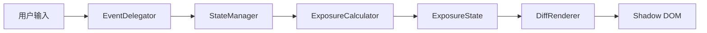

<h1 align="center">ndx</h1>
<p align="center"><strong>ND滤镜曝光补偿计算器</strong></p>
<p align="center">一个零依赖的Web Component，用于计算ND滤镜下的曝光补偿值</p>

<p align="center">
  <a href="./README.md">English</a> | <a href="./README.ja.md">日本語</a>
</p>

<p align="center">
  
  
  
  
  
  
</p>

## 什么是 ndx？

在户外拍摄时，ND滤镜的曝光换算是件令人头疼的事。快门速度遵循等比数列，而高档位ND滤镜（如ND1000）会将快门推入30秒以上的B门区域——这时候靠心算几乎不可能准确换算。翻查对照表既不方便，也容易出错。

ndx 就是为了解决这个问题而诞生的。只需一个 `<ndx-calc>` HTML标签，就能将一个功能完整的曝光补偿计算器嵌入到任何网页或博客中。不需要npm，不需要构建工具，不需要CDN。整个计算器只有19 KB，是一个完全自包含的HTML文件。

## 快速开始

```html
<ndx-calc></ndx-calc>
<script src="ndx.min.js"></script>
```

无需 npm。无需构建工具。无需 CDN。将 `dist/index.html` 的内容复制到任意 HTML 页面或博客平台的 HTML 卡片中即可。

### 无 JavaScript 环境的降级方案

```html
<ndx-calc>
  <p style="padding:1em;text-align:center;color:#666;">
    ND滤镜计算器需要JavaScript支持。
  </p>
</ndx-calc>
```

## 功能特性

- **快门速度 / 光圈 / ISO 补偿** — 以快门速度为主要补偿方式，同时提供光圈和ISO的替代方案
- **ND1–ND20 全范围** — 支持1到20档，内置常用预设（ND4、ND8、ND16、ND64、ND1000）
- **B门区域外推** — 超过30秒后自动计算并格式化为分钟/小时（如 `8m 32s`、`2h 15m`）
- **EV显示** — 显示ND滤镜应用前后的曝光值
- **明暗主题自动切换** — 自动跟随 `prefers-color-scheme`
- **WCAG 2.1 AA 无障碍** — 键盘导航、ARIA角色、屏幕阅读器支持、对比度≥4.5:1
- **响应式布局** — 移动端单列，≥576px 双列网格
- **完全离线** — 无需网络，断网也能使用
- **Shadow DOM 隔离** — 样式互不干扰，可安全嵌入任何页面

## 架构

ndx 采用**整洁架构**，遵循严格的**单向数据流**：

```
用户输入 → EventDelegator → StateManager → ExposureCalculator → ExposureState → DiffRenderer → Shadow DOM
```



### 1/3档索引系统

核心设计创新：**所有曝光参数在内部以1/3档为单位的整数索引表示**。

彻底消除浮点误差。档位运算简化为整数加法：

```
ND8（3档）= 3 × 3 = 9（1/3档偏移量）
1/125（索引18）+ 9 = 索引27 → 1/15
```

- 显示值通过查找表 O(1) 获取
- B门区域（>30秒）通过数学公式外推：`基准秒数 × 2^(偏移量/3)`
- 光圈和ISO在物理极限处钳位，通过 `isClamped` 标志触发UI警告

→ [详细架构文档](./docs/architecture.zh.md)

## 自定义

通过覆盖CSS自定义属性来匹配您的网站设计。属性可穿透Shadow DOM边界：

```html
<style>
  ndx-calc {
    --ndx-accent: #e11d48;
    --ndx-accent-hover: #be123c;
    --ndx-radius-lg: 0;
    --ndx-font-family: 'Georgia', serif;
  }
</style>
```

| 属性 | 用途 | 默认值（浅色） |
|-----|------|-------------|
| `--ndx-accent` | 强调色 | `#2563eb` |
| `--ndx-bg` | 背景色 | `#fafafa` |
| `--ndx-text` | 文字颜色 | `#1a1a1a` |
| `--ndx-surface` | 卡片表面 | `#ffffff` |
| `--ndx-border` | 边框颜色 | `#e0e0e0` |
| `--ndx-font-family` | 字体 | `system-ui` |

→ [完整CSS API参考（22个属性）](./docs/api.md)

## 浏览器支持

| 浏览器 | 最低版本 |
|-------|---------|
| Chrome | 67+ |
| Firefox | 63+ |
| Safari | 13.1+ |
| Edge | 79+ |

需要 Custom Elements v1 和 Shadow DOM v1 支持。不兼容的浏览器将显示降级文本。

## 开发

### 前置要求

- [Bun](https://bun.sh/)（包管理器和运行时）

### 命令

```bash
bun install                # 安装开发依赖
bun run dev                # 开发服务器（localhost:5173）
bun run build              # 生产构建 → dist/index.html
bun run test               # 运行所有单元测试（Vitest）
bun run test:watch         # 监听模式
bun run test:coverage      # 覆盖率报告
bun run test:e2e           # Playwright E2E测试
bun run lint               # Biome lint + 格式检查
bun run lint:fix           # 自动修复lint问题
bun run format             # 自动格式化
```

### 技术栈

| 工具 | 用途 |
|-----|------|
| Vite | 开发服务器 + 构建（`vite-plugin-singlefile`） |
| Vitest | 单元 + 集成测试 |
| Playwright | E2E浏览器测试 |
| Biome | 代码检查 + 格式化 |
| happy-dom | UI单元测试DOM环境 |

## 项目结构

```
src/
├── domain/                  # 领域层（纯JS，无DOM依赖）
│   ├── shutter-speed.js     # 快门速度值对象（1/3档索引）
│   ├── aperture.js          # 光圈值对象（边界钳位）
│   ├── iso.js               # ISO值对象（边界钳位）
│   ├── nd-filter.js         # ND滤镜值对象（档数/倍率/光密度/透过率）
│   ├── exposure-calculator.js  # 无状态补偿计算服务
│   └── exposure-result.js   # 不可变计算结果
├── state/                   # 状态管理层
│   ├── exposure-state.js    # 不可变状态（`with()` 部分更新）
│   └── state-manager.js     # 观察者模式，触发重新计算
├── ui/                      # UI层
│   ├── template.js          # Shadow DOM HTML生成
│   ├── styles.js            # CSS自定义属性 + 组件样式
│   └── diff-renderer.js     # data-bind 差量DOM更新
├── ndx-calc-element.js      # Custom Element 入口（连接所有层）
└── index.js                 # 注册
```

## 设计决策

**为什么零依赖？**
ndx 的设计目标是作为HTML卡片粘贴到博客平台中。任何外部依赖（CDN链接、npm包）都是潜在的故障点，且会给非技术用户增加使用门槛。

**为什么不用 React/Vue/Svelte？**
框架运行时会使打包体积成倍增长，违反零依赖约束。Web Components是浏览器原生的封装、可复用UI元素方案。

**为什么用整数索引而非浮点数？**
相机曝光值遵循标准化的1/3档序列，无法用浮点数精确映射。整数索引系统使档位运算精确——只需 `index + offset`，完全没有舍入误差。

**为什么用 Shadow DOM？**
博客平台的CSS环境不可预测。Shadow DOM保证宿主页面的样式不会影响计算器，计算器的样式也不会泄漏到外部。CSS自定义属性提供了可控的主题定制接口。

## 许可证

MIT License © 2026 [Yasunobu Sakashita](https://github.com/because-and)
