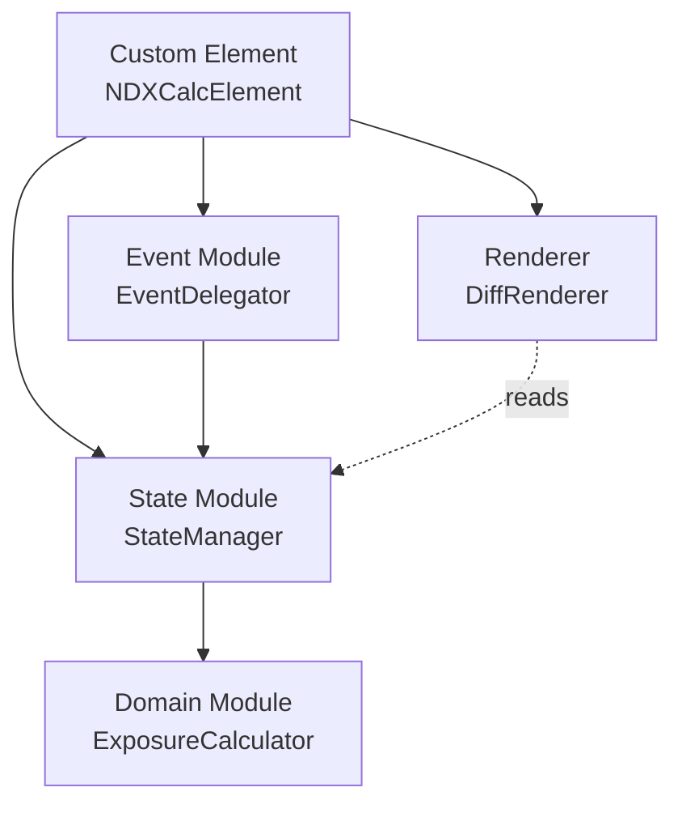
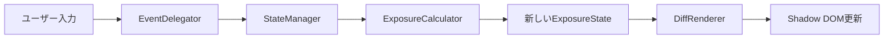
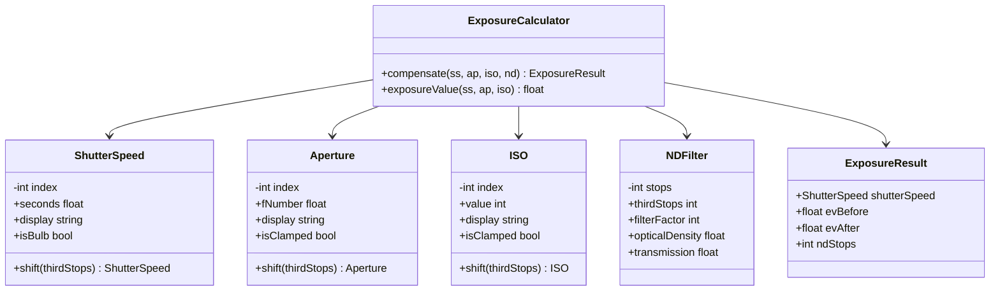

# アーキテクチャ

[← READMEに戻る](../README.ja.md)

## 設計原則

- **クリーンアーキテクチャ**: 露出計算のドメインロジックをUI層から完全に分離。ドメイン層はDOMに一切依存しない純粋なJavaScript
- **単方向データフロー**: State → View → Event → Stateの循環で状態管理。双方向バインディングによる状態の発散を防止
- **不変状態**: 状態更新は常に新しいオブジェクトを生成。副作用を`setState`メソッドに局所化し、差分検出を参照比較で完結
- **イベント委譲**: Shadow Root上の単一イベントリスナーで全UIイベントを捕捉。`data-*`属性でディスパッチ
- **Progressive Enhancement**: JavaScript無効環境ではフォールバックメッセージを表示

## モジュール構成



| モジュール | 責務 |
|----------|------|
| **Domain Module** | DOM非依存。値オブジェクト（ShutterSpeed, Aperture, ISO, NDFilter）とExposureCalculator。全クラスは不変 |
| **State Module** | 不変のExposureStateオブジェクトとStateManager（オブザーバーパターン） |
| **Renderer** | DiffRendererがdata-bind属性で差分更新。バインディングキャッシュをMapで管理 |
| **Event Module** | data-action属性によるイベント委譲。AbortControllerでライフサイクル管理 |
| **Custom Element** | connectedCallbackで全モジュールを手動DI |

## 単方向データフロー



1. ユーザーがUI要素を操作（セレクタ変更、ボタンクリック、スライダー操作）
2. EventDelegatorがイベントを捕捉し、アクションオブジェクトに変換
3. StateManagerがExposureCalculatorを呼び出し、新しい状態を算出
4. StateManagerが新旧状態を比較し、変更があればDiffRendererに通知
5. DiffRendererが変更されたプロパティに対応するDOM要素のみを更新

## 依存性注入

DIフレームワークは使用しない。Custom Elementの`connectedCallback`内で手動組み立て:

```js
const calculator = new ExposureCalculator();
const stateManager = new StateManager(calculator);
const renderer = new DiffRenderer(this.#shadow);
stateManager.subscribe((state) => renderer.render(state));
stateManager.initialize();
```

## ドメインモデル

### 数学的基盤

露出値（EV）の定義:

```
EV = log₂(N²/t) + log₂(S/100)
```

N = 絞り値、t = 露出時間（秒）、S = ISO感度。

NDフィルターのn段は入射光量を2ⁿ分の1に減少させる。同一露出維持には:
- シャッタースピードをn段遅くする（露出時間を2ⁿ倍）

### 1/3段インデックス方式（核心設計）

全露出パラメータを「1/3段単位の整数インデックス」で内部管理:

- 段数計算が整数演算のみで完結（浮動小数点誤差ゼロ）
- NDフィルターのn段 = n×3の1/3段インデックス差分
- 標準値列のルックアップは配列アクセスO(1)
- バルブ領域は数式で外挿: `基準秒数 × 2^(オフセット/3)`

### クラス図



### 値オブジェクト

**ShutterSpeed**: 標準55値（1/8000〜30"）。インデックス0 = 1/8000（最速）、インデックス54 = 30"（最遅）。54超はバルブ領域で数式外挿。分・時間形式で表示。デフォルト: 1/125（インデックス18）。

**Aperture**: 31値（f/1.0〜f/32）。配列境界でクランプ。`isClamped`で限界検出。デフォルト: f/1.8（インデックス5）。

**ISO**: 31値（ISO 50〜ISO 51200）。同様にクランプ。デフォルト: ISO 100（インデックス3）。

**NDFilter**: 整数段数1-20。派生プロパティ: filterFactor = 2^stops、opticalDensity = stops × log₁₀(2)、transmission = 100/filterFactor。プリセット: ND4(2段), ND8(3段), ND16(4段), ND64(6段), ND1000(10段)。

> **設計ノート: クランプ vs 外挿** — ShutterSpeedはバルブ領域に外挿する（30秒超の長時間露光は実用的に使用される）。Aperture/ISOはクランプする（f/1.0やf/32を超える値は物理的なレンズの制約であり実用的意味がない）。

### ExposureCalculator
ステートレスなサービス。`compensate()`メソッドは基準絞り/ISOインデックスを受け取り、絞りやISO変更時にND補正を再配分する: `totalShift = ndThirdStops + (curAv - refAv) - (curISO - refISO)`。

## 状態管理

### ExposureState
Object.freeze()による不変オブジェクト。`with()`メソッドで部分更新した新しいインスタンスを返す。フィールド: `shutterSpeed`, `aperture`, `iso`, `ndFilter`, `result`, `refApertureIndex`, `refISOIndex`。参照インデックスはEVロック補正に使用される。

### StateManager
ExposureCalculatorへの参照を保持。オブザーバーパターン（Set<listener>）。各セッター（setShutterSpeed, setAperture, setISO, setNDStops）が状態更新→再計算→通知。`setShutterSpeed`は現在の絞り/ISOインデックスを参照値としてスナップショットする。setNDStopsはRangeErrorをキャッチ。

## レンダリング

### DiffRenderer
初期化時に`[data-bind]`要素を全てMapにキャッシュ。render()では`textContent`が異なる場合のみ更新。CSSクラス名をセレクタに使わないことで、スタイル変更がレンダリングに影響しない。

## イベント処理

### イベント委譲
Shadow Root上の3つのリスナー（全てAbortController signal付き）:
- `change`: セレクト要素（data-action: ss, aperture, iso）
- `input`: レンジスライダー（data-action: stops）
- `click`: プリセットボタン（data-action="preset" + closest()）

### キーボードナビゲーション
プリセットradiogroup: Arrow（Left/Right/Up/Down）、Home、End。境界でラップアラウンド。

### AbortControllerライフサイクル
connectedCallbackでAbortController生成→全addEventListener にsignal渡し→disconnectedCallbackでabort()→全リスナー一括解除。

## アクセシビリティ

### ARIA実装
- `<select>`: ネイティブa11y（label + for）
- プリセット: `role="radiogroup"` > `role="radio"` + `aria-checked`
- 結果セクション: `aria-live="polite"`
- バルブバッジ・警告: `hidden`属性

### カラーコントラスト（WCAG 2.1 AA）

| 要素 | 前景色 | 背景色 | コントラスト比 |
|-----|-------|-------|-------------|
| 本文テキスト（Light） | #1a1a1a | #fafafa | 18.1:1 |
| 本文テキスト（Dark） | #e8e8ed | #1a1a1e | 15.2:1 |
| セカンダリ（Light） | #6b6b6b | #ffffff | 5.7:1 |
| セカンダリ（Dark） | #9a9aa0 | #242428 | 5.3:1 |
| アクセント（Light） | #ffffff | #2563eb | 5.1:1 |
| アクセント（Dark） | #1a1a1e | #60a5fa | 7.8:1 |

### モーション低減
`prefers-reduced-motion: reduce`で全トランジション無効化（0.01ms）。

## エラー処理

- **NDFilter**: 1-20の範囲外・非整数でRangeError。UIはmin/max/stepで制約
- **ShutterSpeed（バルブ）**: 上限なしで外挿（ND20 + 30" ≈ 121日にも対応）
- **Aperture/ISO**: 物理限界でクランプ、isClampedフラグでUI警告
- **防御的プログラミング**: parseInt結果のNaN検証、data属性不在の早期リターン、RangeErrorキャッチ
