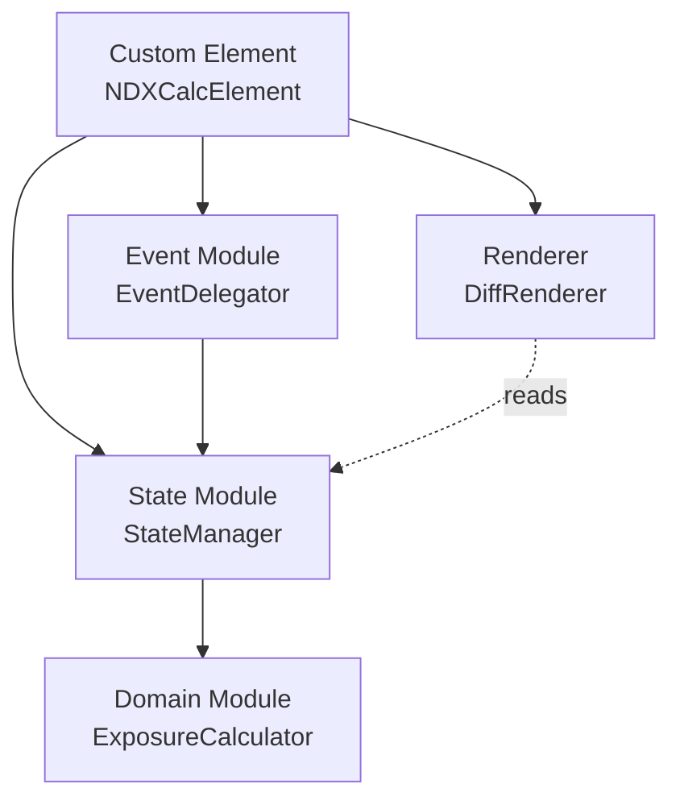
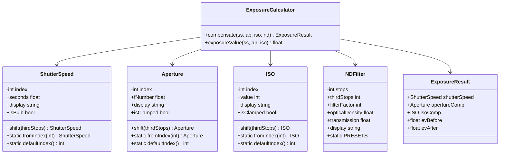

# Architecture

[Back to README](../README.md)

## Design Principles

The ndx project follows five core design principles that guide every architectural decision.

**Clean Architecture** — Domain logic is fully separated from the UI layer. The domain module has zero DOM dependency and can be tested in a pure Node.js environment without any browser APIs. This separation ensures that the exposure calculation engine remains portable and independently verifiable.

**Unidirectional Data Flow** — Data flows in a single direction through the system: State to View to Event to State. There are no two-way bindings or circular update paths. This makes the system predictable and easy to reason about.

**Immutable State** — All state updates produce new objects rather than mutating existing ones. Side effects are localized entirely to the `setState` path within `StateManager`. This eliminates an entire class of bugs related to shared mutable state.

**Event Delegation** — Rather than attaching listeners to individual elements, a single event listener on the Shadow Root dispatches actions based on `data-*` attributes. This reduces memory overhead and simplifies lifecycle management.

**Progressive Enhancement** — When JavaScript is disabled, fallback text is displayed. The component degrades gracefully rather than rendering a blank space.

---

## Module Structure



The application is composed of five modules, each with a clearly defined responsibility.

### Domain Module

The domain module is entirely DOM-free, written in pure JavaScript. It contains the value objects (`ShutterSpeed`, `Aperture`, `ISO`, `NDFilter`) and the `ExposureCalculator` service. Every class in this module is immutable — all methods that would logically "modify" an instance instead return a new instance. Because the domain module has no browser dependency, its tests run directly in Node.js with no DOM environment needed.

### State Module

The state module consists of two components. `ExposureState` is an immutable state object that provides a `with()` method for partial updates, returning a new state instance each time. `StateManager` implements the observer pattern: it holds the current state, triggers recalculation through `ExposureCalculator` when inputs change, and notifies all registered subscribers of the new state.

### Renderer

`DiffRenderer` uses a `data-bind` attribute system to target DOM elements for differential updates. At initialization time, it scans the Shadow DOM for all elements with `data-bind` attributes and caches the bindings in a `Map`. On each render pass, it compares the new state against what is currently displayed and updates only the elements that have actually changed.

### Event Module

`EventDelegator` implements event delegation via `data-action` attributes on interactive elements. A small number of listeners are attached to the Shadow Root itself rather than to individual elements. An `AbortController` manages the listener lifecycle — all listeners are created with the controller's signal and are torn down in a single `abort()` call during `disconnectedCallback`.

### Custom Element

`NDXCalcElement` is the glue layer. It wires all modules together in `connectedCallback` using manual dependency injection. It does not contain business logic; its sole purpose is assembly and lifecycle management.

---

## Data Flow


Every user interaction follows the same five-step path through the system:

1. **User operates the UI** — A select element changes, a preset button is clicked, or the ND stops slider is adjusted.
2. **EventDelegator captures the event** — The delegated listener on the Shadow Root intercepts the event, reads the `data-action` attribute to determine what kind of action it is, and translates it into the appropriate `StateManager` method call.
3. **StateManager invokes ExposureCalculator** — The state manager calls the calculator with the updated input parameters. The calculator produces a new `ExposureResult` containing the compensated shutter speed, aperture, ISO, and EV values.
4. **StateManager compares old and new state** — The manager creates a new `ExposureState` via `with()`, compares it against the previous state, and notifies all subscribed observers (the renderer) of the change.
5. **DiffRenderer updates the DOM** — The renderer walks its cached binding map, compares each bound value against the corresponding DOM element's current text, and writes only the values that have actually changed.

---

## Dependency Injection

There is no DI framework. All wiring is performed manually in `connectedCallback`:

```js
const calculator = new ExposureCalculator();
const stateManager = new StateManager(calculator);
const renderer = new DiffRenderer(this.#shadow);
const delegator = new EventDelegator(this.#shadow, stateManager);
stateManager.subscribe((state) => renderer.render(state));
delegator.bind();
stateManager.initialize();
```

Each module receives its dependencies as constructor arguments. The custom element creates the instances in the correct order, connects the observer subscription, and kicks off initialization. This approach keeps the dependency graph explicit and easy to follow without any framework magic.

---

## Domain Model

### Mathematical Foundation

Exposure Value (EV) is defined as:

```
EV = log2(N^2 / t) + log2(S / 100)
```

Where **N** is the f-number, **t** is the exposure time in seconds, and **S** is the ISO sensitivity.

An ND filter of **n** stops reduces the light reaching the sensor by a factor of **2^n**. To compensate and maintain equivalent exposure, the photographer can:

- **Slow the shutter** by n stops (multiply exposure time by 2^n)
- **Open the aperture** by n stops (divide the f-number by 2^(n/2))
- **Raise the ISO** by n stops (multiply ISO by 2^n)

### The 1/3-Stop Index System

This is the core design decision of the entire project. All exposure parameters are internally represented as **integer indices in 1/3-stop increments**. This approach delivers several critical benefits:

- **Stop arithmetic becomes integer addition** — There are no floating-point rounding errors, ever. Adding 2 stops to a shutter speed is simply `index + 6`.
- **ND filter offset is trivial** — An ND filter of n stops equals an offset of `n * 3` third-stop indices.
- **Display values come from lookup tables** — Converting an index to a human-readable string (e.g., "1/125", "f/2.8", "ISO 400") is an O(1) array lookup.
- **Bulb range extrapolation** — For shutter speeds beyond the standard range, the formula `baseSeconds * 2^(offset/3)` produces the correct exposure time.

### Class Diagram



### Value Objects in Detail

**ShutterSpeed** — Covers 55 standard values from 1/8000s to 30s. Index 0 represents the fastest speed (1/8000), and index 54 represents the slowest standard speed (30s). Beyond index 54 lies bulb territory, where values are extrapolated using the formula `seconds[54] * 2^((index - 54) / 3)`. Long exposures are automatically formatted in minutes or hours for readability. The default value is 1/125s (index 18).

**Aperture** — Spans 31 values from f/1.0 to f/32. The array clamps at both bounds: f/1.0 is the widest physical aperture and f/32 is the smallest. The `isClamped` property returns `true` when the value sits at either limit, enabling the UI to display a warning. The default value is f/1.8 (index 5).

**ISO** — Spans 31 values from ISO 50 to ISO 51200. Clamping behavior mirrors Aperture. The default value is ISO 100 (index 3).

**NDFilter** — Accepts integer stop values from 1 to 20. All other properties are derived: `filterFactor = 2^stops`, `opticalDensity = stops * log10(2)`, `transmission = 100 / filterFactor`. The standard presets are ND4 (2 stops), ND8 (3 stops), ND16 (4 stops), ND64 (6 stops), and ND1000 (10 stops).

> **Design note: Clamp vs. Extrapolate** — ShutterSpeed extrapolates into bulb territory because photographers regularly use exposures well beyond 30 seconds (long exposure photography with strong ND filters is the primary use case for this tool). Aperture and ISO clamp at their bounds because f/1.0 and f/32 represent physical lens limits — values beyond them have no practical meaning.

### ExposureCalculator

`ExposureCalculator` is a stateless service with no internal state. Its `compensate()` method takes the base exposure parameters and an ND filter, then returns an `ExposureResult`. The compensation logic shifts shutter speed by `+thirdStops` (slower), aperture by `-thirdStops` (wider), and ISO by `+thirdStops` (higher sensitivity). It also calculates the EV before and after applying the filter.

---

## State Management

### ExposureState

`ExposureState` is an immutable state object. Every instance is frozen with `Object.freeze()` immediately after construction. The `with()` method accepts a partial object of fields to update and returns a brand-new `ExposureState` instance with those fields replaced. Fields include: `shutterSpeed`, `aperture`, `iso`, `ndFilter`, and `result`.

### StateManager

`StateManager` holds the current `ExposureState` and a reference to the `ExposureCalculator`. It implements the observer pattern using a `Set` of listener functions. Each setter method (`setShutterSpeed`, `setAperture`, `setISO`, `setNDStops`) updates the relevant portion of state and triggers a full recalculation. The `setNDStops` method wraps its logic in a try/catch to handle `RangeError` exceptions thrown by `NDFilter` for invalid inputs (values outside 1-20 or non-integers).

---

## Rendering

### DiffRenderer

During initialization, `DiffRenderer` queries the Shadow DOM for all elements carrying a `[data-bind]` attribute and caches them in a `Map` keyed by the bind name. On each `render()` call, it iterates over the map and updates only the elements whose text content has actually changed.

The `#setText()` private method compares the element's current `textContent` against the new value before writing, avoiding unnecessary DOM mutations. The `#setHidden()` private method toggles the `hidden` attribute on elements that should be conditionally visible (such as the bulb badge or clamping warnings).

### data-bind System

Elements declare their binding with a `data-bind="keyName"` attribute in the HTML template. The renderer maps state properties to DOM elements exclusively through these keys. Importantly, CSS class names are never used as selectors for rendering — this means style refactors cannot accidentally break the rendering logic.

---

## Event Handling

### Event Delegation

Three event listeners are attached to the Shadow Root, all sharing a single `AbortController` signal:

- **`change`** — Handles select element changes for shutter speed, aperture, and ISO. The `data-action` attribute on each `<select>` identifies which parameter changed.
- **`input`** — Handles the range slider for ND filter stops. The `data-action` attribute identifies this as a stops adjustment.
- **`click`** — Handles preset button clicks. The handler uses `data-action="preset"` combined with `closest()` to find the clicked preset and read its `data-stops` attribute.

### Keyboard Navigation

The preset button group is implemented as a `role="radiogroup"` with individual `role="radio"` buttons. Arrow key navigation (Left, Right, Up, Down) moves focus between presets. Home and End keys jump to the first and last preset respectively. Navigation wraps around at both boundaries.

### AbortController Lifecycle

The constructor creates an `AbortController`. During `connectedCallback`, every `addEventListener` call includes `{ signal: controller.signal }` in its options. When `disconnectedCallback` fires, a single `controller.abort()` call removes all event listeners at once. This pattern eliminates the need to track and manually remove individual listeners.

---

## Accessibility

### ARIA Implementation

- **Select elements** — Use native `<select>` elements with associated `<label>` elements connected via `for` attributes. This provides full keyboard and screen reader accessibility for free.
- **Preset buttons** — Wrapped in a `role="radiogroup"` container. Each button has `role="radio"` and `aria-checked` toggled to reflect the active preset.
- **Result section** — Marked with `aria-live="polite"` so screen readers announce updated exposure values after each calculation without interrupting the user.
- **Bulb badge and warnings** — Controlled via the `hidden` attribute, which removes them from both visual display and the accessibility tree.

### Color Contrast (WCAG 2.1 AA)

All color combinations meet or exceed the 4.5:1 contrast ratio required by WCAG 2.1 AA:

| Element | Foreground | Background | Ratio | Passes |
|---|---|---|---|---|
| Primary text (Light) | `#1a1a1a` | `#fafafa` | 18.1:1 | Yes |
| Primary text (Dark) | `#e8e8ed` | `#1a1a1e` | 15.2:1 | Yes |
| Secondary text (Light) | `#6b6b6b` | `#ffffff` | 5.7:1 | Yes |
| Secondary text (Dark) | `#9a9aa0` | `#242428` | 5.3:1 | Yes |
| Accent button (Light) | `#ffffff` | `#2563eb` | 5.1:1 | Yes |
| Accent button (Dark) | `#1a1a1e` | `#60a5fa` | 7.8:1 | Yes |
| Warning (Light) | `#dc2626` | `#ffffff` | 4.6:1 | Yes |
| Warning (Dark) | `#f87171` | `#242428` | 5.4:1 | Yes |

### Reduced Motion

When the user has `prefers-reduced-motion: reduce` enabled, all CSS transitions are set to `0.01ms`, effectively disabling animations while maintaining transition event compatibility.

---

## Error Handling

### Boundary Conditions

- **NDFilter** — Throws a `RangeError` for stop values less than 1, greater than 20, or non-integer. The UI constrains input via `min`, `max`, and `step` attributes on the range slider, but the domain model enforces the invariant independently.
- **ShutterSpeed (bulb range)** — Extrapolates without an upper limit. At the extreme end, ND20 combined with a 30-second base exposure produces approximately 121 days. The formatter handles arbitrarily large values.
- **Aperture and ISO** — Clamp to their physical limits. The `isClamped` flag allows the UI to display a visual warning indicating that the requested compensation exceeds what is physically possible.

### Defensive Programming

- **Input validation** — All `parseInt` results are checked with `Number.isNaN` before being passed to `StateManager`. Invalid numeric input is silently rejected.
- **Missing attributes** — If a `data-action` or `data-stops` attribute is missing on an event target, the handler returns early without side effects.
- **StateManager error isolation** — `setNDStops` wraps the update in a try/catch. `RangeError` exceptions (from invalid ND values) are caught and ignored, keeping the previous valid state. Any other exception type is re-thrown to surface genuine bugs.
