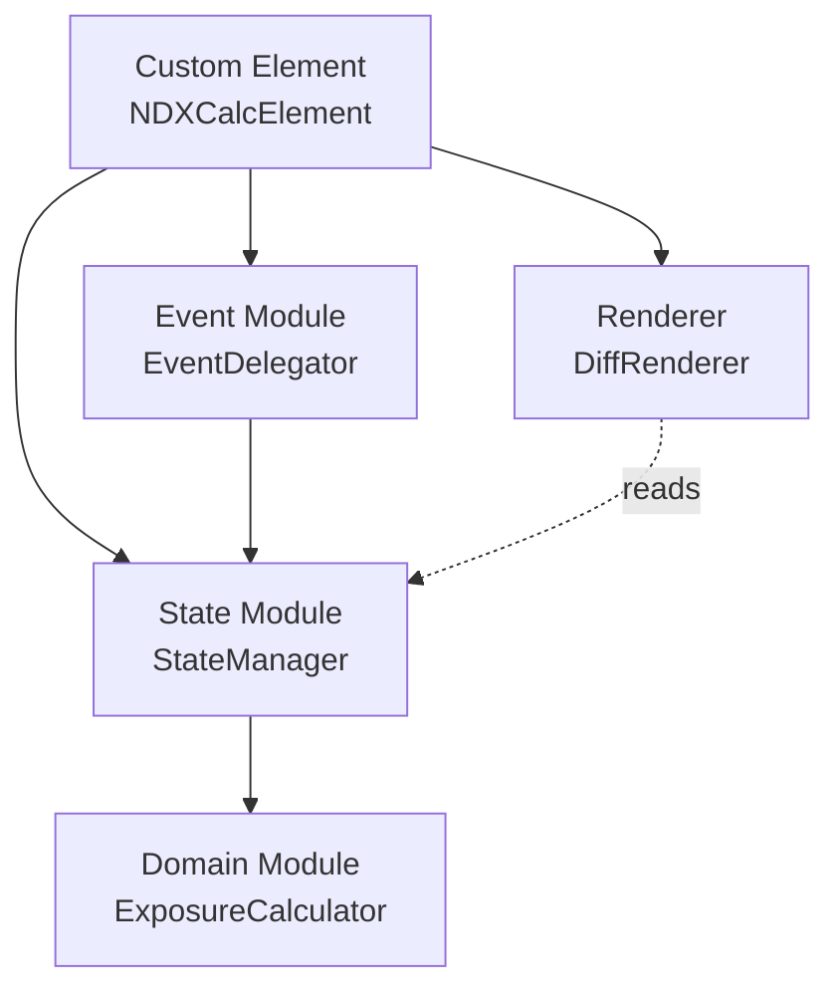
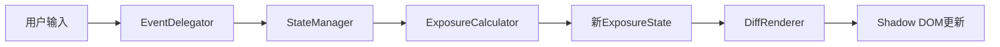
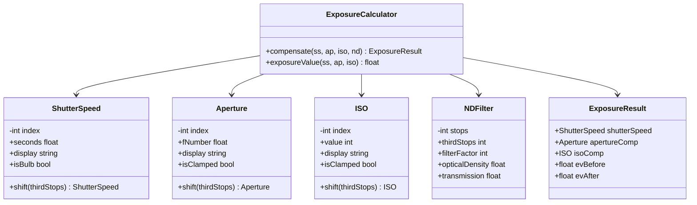

# 架构

[← 返回 README](../README.zh.md)

## 设计原则

- **整洁架构**: 曝光计算领域逻辑与UI层完全分离。领域层零DOM依赖，纯JavaScript实现
- **单向数据流**: State → View → Event → State 循环管理状态，防止双向绑定导致的状态发散
- **不可变状态**: 每次状态更新都生成新对象，副作用局限于setState方法。差异检测通过引用比较完成
- **事件委托**: Shadow Root上的单一事件监听器捕获所有UI事件，通过data-*属性分发
- **渐进增强**: JavaScript禁用环境下显示降级文本

## 模块结构



| 模块 | 职责 |
|-----|------|
| **Domain Module** | 无DOM依赖。值对象（ShutterSpeed、Aperture、ISO、NDFilter）和ExposureCalculator。全部不可变 |
| **State Module** | 不可变的ExposureState对象和StateManager（观察者模式） |
| **Renderer** | DiffRenderer通过data-bind属性进行差量更新。绑定缓存存储在Map中 |
| **Event Module** | 通过data-action属性实现事件委托。AbortController管理生命周期 |
| **Custom Element** | 在connectedCallback中手动依赖注入 |

## 单向数据流



1. 用户操作UI元素（下拉选择、按钮点击、滑块操作）
2. EventDelegator捕获事件并转换为动作对象
3. StateManager调用ExposureCalculator计算新状态
4. StateManager比较新旧状态，有变化则通知DiffRenderer
5. DiffRenderer仅更新发生变化的DOM元素

## 依赖注入

不使用DI框架。在Custom Element的connectedCallback中手动组装：

```js
const calculator = new ExposureCalculator();
const stateManager = new StateManager(calculator);
const renderer = new DiffRenderer(this.#shadow);
stateManager.subscribe((state) => renderer.render(state));
stateManager.initialize();
```

## 领域模型

### 数学基础

曝光值（EV）定义：

```
EV = log₂(N²/t) + log₂(S/100)
```

N = 光圈值，t = 曝光时间（秒），S = ISO感光度。

ND滤镜n档将入射光量减少2ⁿ倍。维持等效曝光需要：
- 快门速度减慢n档（曝光时间乘以2ⁿ）
- 光圈开大n档（f值除以2^(n/2)）
- ISO提高n档（ISO值乘以2ⁿ）

### 1/3档索引系统（核心设计）

所有曝光参数以「1/3档为单位的整数索引」进行内部管理：

- 档位运算完全是整数运算（零浮点误差）
- ND滤镜n档 = n×3 的1/3档索引偏移
- 标准值序列查找为数组访问 O(1)
- B门区域通过公式外推：`基准秒数 × 2^(偏移量/3)`

### 类图



### 值对象详解

**ShutterSpeed**：55个标准值（1/8000至30"）。索引0 = 1/8000（最快），索引54 = 30"（最慢）。超过54进入B门区域，通过公式外推。以分钟/小时格式显示。默认：1/125（索引18）。

**Aperture**：31个值（f/1.0至f/32）。在数组边界钳位。`isClamped`检测极限。默认：f/1.8（索引5）。

**ISO**：31个值（ISO 50至ISO 51200）。同样钳位。默认：ISO 100（索引3）。

**NDFilter**：整数档数1-20。派生属性：filterFactor = 2^stops，opticalDensity = stops × log₁₀(2)，transmission = 100/filterFactor。预设：ND4(2档)、ND8(3档)、ND16(4档)、ND64(6档)、ND1000(10档)。

> **设计笔记：钳位 vs 外推** — ShutterSpeed外推至B门区域（超过30秒的长曝光在实际拍摄中确实使用）。Aperture/ISO钳位（超过f/1.0或f/32的值属于物理镜头限制，没有实际意义）。

## 状态管理

### ExposureState
通过Object.freeze()实现不可变对象。`with()`方法返回部分更新的新实例。

### StateManager
持有ExposureCalculator引用。观察者模式（Set<listener>）。各setter更新状态→重新计算→通知。setNDStops捕获RangeError。

## 渲染

### DiffRenderer
初始化时将所有`[data-bind]`元素缓存到Map中。render()仅在textContent不同时更新。不使用CSS类名作为选择器——样式变更不影响渲染逻辑。

## 事件处理

### 事件委托
Shadow Root上的3个监听器（全部附带AbortController signal）：
- `change`：Select元素（data-action: ss, aperture, iso）
- `input`：Range滑块（data-action: stops）
- `click`：预设按钮（data-action="preset" + closest()）

### 键盘导航
预设radiogroup支持方向键（Left/Right/Up/Down）、Home、End。边界处循环。

### AbortController生命周期
connectedCallback创建AbortController → 所有addEventListener传入signal → disconnectedCallback调用abort() → 所有监听器一次性移除。

## 无障碍

### ARIA实现
- `<select>`：原生无障碍支持（label + for）
- 预设按钮：`role="radiogroup"` > `role="radio"` + `aria-checked`
- 结果区域：`aria-live="polite"`
- B门徽章/警告：`hidden`属性

### 色彩对比度（WCAG 2.1 AA）

| 元素 | 前景色 | 背景色 | 对比度 |
|-----|-------|-------|-------|
| 正文（浅色） | #1a1a1a | #fafafa | 18.1:1 |
| 正文（深色） | #e8e8ed | #1a1a1e | 15.2:1 |
| 次要文字（浅色） | #6b6b6b | #ffffff | 5.7:1 |
| 次要文字（深色） | #9a9aa0 | #242428 | 5.3:1 |
| 强调按钮（浅色） | #ffffff | #2563eb | 5.1:1 |
| 强调按钮（深色） | #1a1a1e | #60a5fa | 7.8:1 |

### 减弱动效
`prefers-reduced-motion: reduce` 禁用所有过渡动画（0.01ms）。

## 错误处理

- **NDFilter**：超出1-20范围或非整数时抛出RangeError。UI通过min/max/step约束
- **ShutterSpeed（B门）**：无上限外推（ND20 + 30" ≈ 121天也能正确显示）
- **Aperture/ISO**：物理极限钳位，isClamped标志触发UI警告
- **防御性编程**：parseInt结果NaN验证、缺少data属性时提前返回、RangeError捕获
