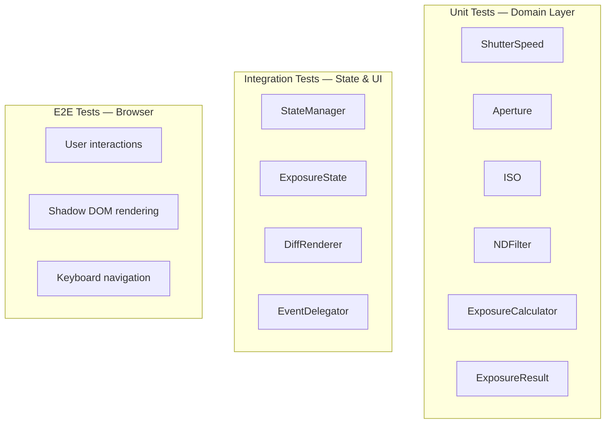

# Testing Strategy

[← Back to README](../README.md)

## Overview

ndx employs a comprehensive testing strategy with **410+ tests** across three layers, reflecting the Clean Architecture of the codebase.

| Layer | Runner | Environment | Test Count |
|-------|--------|-------------|------------|
| Domain (unit) | Vitest | Node.js (no DOM) | ~250 |
| State/UI (integration) | Vitest | happy-dom | ~140 |
| E2E | Playwright | Chromium/Firefox/WebKit | ~20 |

## Test Pyramid



## Domain Layer Tests (Pure Node.js)

The domain layer has **zero DOM dependency**. All value objects and the ExposureCalculator are pure JavaScript — they can be tested directly in Node.js without any DOM environment.

This is a direct benefit of Clean Architecture: the core business logic (exposure math) is completely decoupled from the browser.

### What's tested:
- **ShutterSpeed**: All 55 standard values, bulb extrapolation accuracy, display formatting (seconds/minutes/hours), shift operations, boundary conditions
- **Aperture**: All 31 standard values, clamping at f/1.0 and f/32, isClamped detection, shift operations
- **ISO**: All 31 standard values, clamping at ISO 50 and ISO 51200, shift operations
- **NDFilter**: Stops 1-20 validity, filterFactor/opticalDensity/transmission calculations, preset definitions, RangeError for invalid input
- **ExposureCalculator**: Compensation accuracy across all parameter combinations, EV calculation correctness, boundary conditions (max ND + slowest shutter)

### Example:

```js
it('ND8 on 1/125 should yield 1/15', () => {
  const calc = new ExposureCalculator();
  const ss = ShutterSpeed.fromIndex(18);  // 1/125
  const ap = Aperture.fromIndex(5);       // f/1.8
  const iso = ISO.fromIndex(3);           // ISO 100
  const nd = new NDFilter(3);             // ND8 = 3 stops
  const result = calc.compensate(ss, ap, iso, nd);
  expect(result.shutterSpeed.display).toBe('1/15');
});
```

## State & UI Integration Tests (happy-dom)

State management and UI rendering tests use **happy-dom** as a lightweight DOM environment. This allows testing Shadow DOM behavior, DiffRenderer updates, and StateManager transitions without a full browser.

### What's tested:
- **StateManager**: Observer notification, state transitions, recalculation triggers, unsubscribe, invalid input handling
- **ExposureState**: Immutability (Object.freeze), `with()` partial updates, default state values
- **DiffRenderer**: data-bind element updates, hidden attribute toggling, slider/preset sync, binding cache
- **Template generation**: Correct HTML structure, ARIA attributes, default values

## E2E Tests (Playwright)

Full browser tests with **Playwright** across Chromium, Firefox, and WebKit. These test the complete user experience through Shadow DOM.

### What's tested:
- Preset button selection updates results
- Slider interaction syncs with presets
- Select element changes trigger recalculation
- Bulb badge appears for long exposures
- Keyboard navigation in preset radiogroup
- Dark mode rendering
- Responsive layout transitions
- Warning indicators for clamped values

## Running Tests

```bash
bun run test               # All unit + integration tests
bun run test:watch          # Watch mode for development
bun run test:coverage       # Generate coverage report
bun run test:e2e            # Playwright E2E (requires browser install)
```

## Coverage

Domain layer targets near-100% coverage as it's pure logic. UI layer coverage accounts for DOM interaction paths. E2E tests cover critical user flows rather than aiming for line coverage.
